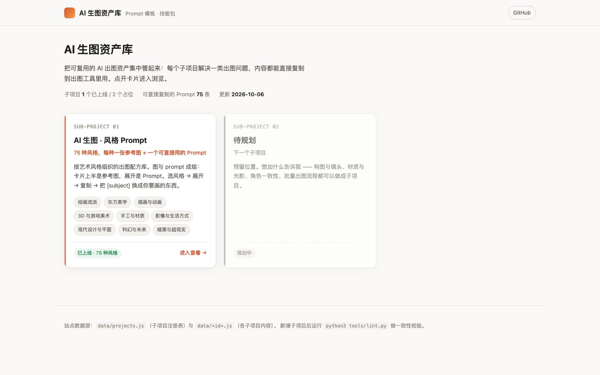
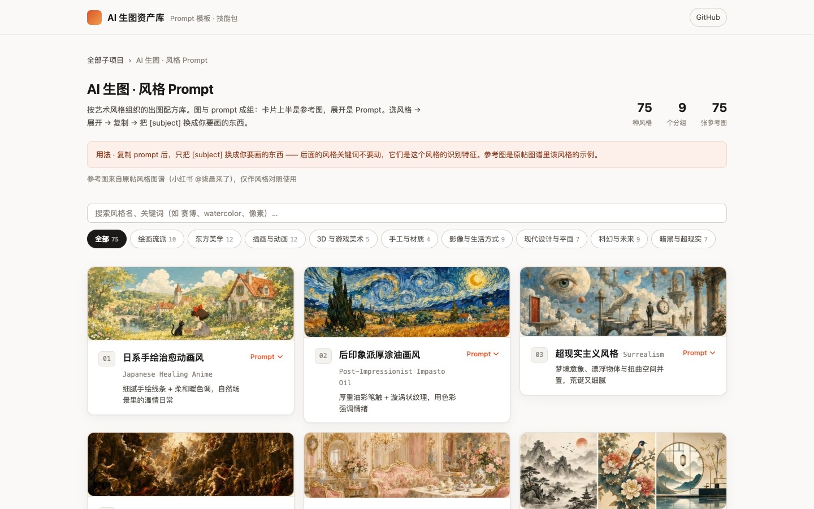
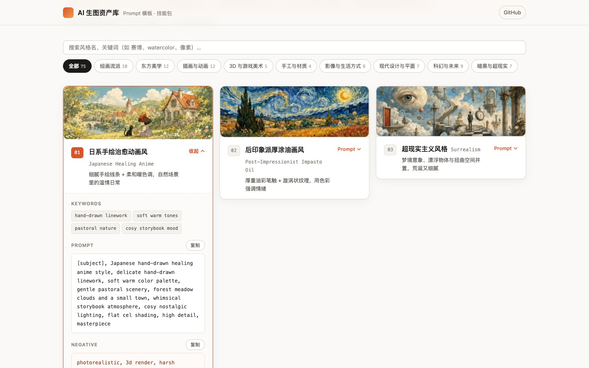

# ai-image-skills

## 项目简介

AI 生图任务的 **Prompt 模板** 与 **Skill 技能包** 集合 —— 把「要 AI 出图」的提示词资产
集中存放、版本化、复用。出图前先来这里翻，而不是每次从零写一段 prompt。

站点按**子项目**组织，每个子项目解决一类出图问题：

| # | 子项目 | 内容 | 状态 |
| --- | --- | --- | --- |
| 01 | **AI 生图 · 风格 Prompt** | 75 种绘画风格，每种一张参考图 + 一个可直接用的 Prompt | ✅ 已上线 |
| 02 | 待规划 | — | 占位 |

子项目 01 分 9 组：绘画流派 10 / 东方美学 12 / 插画与动画 12 / 3D 与游戏美术 5 /
手工与材质 4 / 影像与生活方式 9 / 现代设计与平面 7 / 科幻与未来 9 / 暗黑与超现实 7。

> Prompt 里的 `[subject]` 是**主体占位符**。复制后把它换成你要画的东西，例如
> `[subject]` → `a girl reading by a window`。后面的风格关键词不要动。

## 项目截图

**总览页** —— 列出全部子项目，点卡片进入。



**子项目 01 · 风格列表** —— 75 种风格，卡片上半是参考图，下半是风格名与一句话特征。



**点开才出 Prompt** —— 卡片默认收起；展开后显示关键词、Prompt 正文、负面词，
各带复制按钮，参考图可点开放大。图与 prompt 在同一张卡片里，天然是一组。



## 项目运行

纯静态页面，无需安装任何依赖。

```bash
# 方式一：直接打开（macOS）
open index.html

# 方式二：起个本地服务
python3 -m http.server 8765
# 浏览器打开 http://127.0.0.1:8765
```

校验内容一致性（改过 `data/` 之后跑一下）：

```bash
python3 tools/lint.py
```

---

目录结构、新增子项目、切图工具见 [docs/TOOLS.md](docs/TOOLS.md)；
字段与命名规范见 [docs/CONVENTIONS.md](docs/CONVENTIONS.md)。
